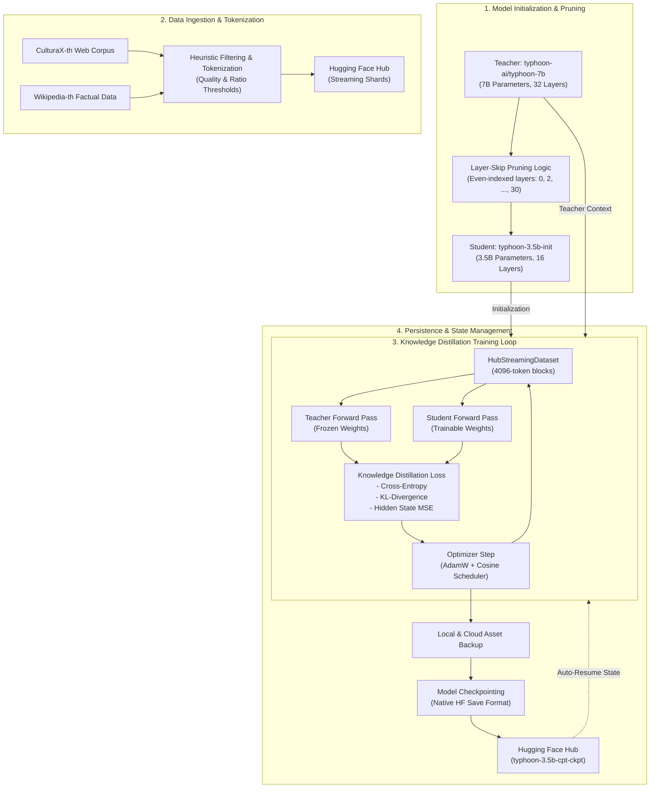

# Project Breeze: Typhoon 3.5B (Distilled SLM)

This repository contains the system architecture, training pipeline, and application prototype for **Topic 2: Fine-Tuning Small Language Model (Sub-4) with Higher Language Model** as part of the internship assignment.

## 1. Project Overview
The objective of this project is to create a highly efficient 3.5B parameter Thai Small Language Model (SLM) by distilling knowledge from a larger, highly capable 7B Teacher model: [typhoon-ai/typhoon-7b](https://huggingface.co/typhoon-ai/typhoon-7b). 

The resulting distilled Student model is published here: [Phonsiri/typhoon-3.5b-cpt-ckpt](https://huggingface.co/Phonsiri/typhoon-3.5b-cpt-ckpt).

Due to hardware constraints (1x H100 GPU with a strict 5-hour daily quota), the project demonstrates advanced resource optimization and a modular training pipeline.

## System Architecture Diagram

## Repository Structure

| File | Description |
|---|---|
| `prune_typhoon_3_5b.py` | Prunes typhoon-7b from 32 → 16 layers (Even-skip). |
| `prepare_thai_data.py` | Data Pipeline for CultureX and Wikipedia Thai. |
| `cpt_distill_train.py` | Main Distillation Training Script with Auto-Resume. |
| `evaluate_model.py` | Local evaluation script for measuring Perplexity (PPL). |
| `app_demo.ipynb` | Application Demo (Gradio + Streamer) for Colab. |

## 2. System Components & Technical Solution
The system is divided into three main components:

### A. Layer Pruning (The Initialization)
* **Algorithm:** Extracted even-numbered transformer layers from the 32-layer Teacher model to create a structurally sound 16-layer Student model (~3.5B parameters).
* **Advantage:** Retains the exact vocabulary, embeddings, and language modeling head of the original Typhoon model.

### B. Distillation Engine (Off-policy CPT)
Instead of standard Pre-training, the model undergoes Deep Knowledge Distillation during the Continual Pre-Training (CPT) phase. The loss function is a combination of three metrics:
1. **Cross-Entropy Loss:** Standard next-token prediction on Thai text data via public Web corpus (CulturaX, Wikipedia).
2. **KL-Divergence Loss:** Logits matching to mimic the probability distribution of the Teacher model.
3. **Hidden States MSE Loss:** Utilizing temporary 4096-dimension Linear Projectors to align the intermediate layer processing between the Student and Teacher.

### C. Automated Pipeline & Auto-Resume
* Implemented a fail-safe Python script that automatically restarts training from Hugging Face Hub.
* Automatically saves Native HF model weights, configurations, and optimizer states locally, and pushes them to the Hugging Face Hub for a seamless auto-resume in the next session.

## 3. Performance Measurement Methods
To evaluate the effectiveness of the distilled 3.5B model against the 7B baseline, the following metrics will be used once the model reaches optimal convergence:
* **Contextual & Reasoning (XNLI-th):** To measure zero-shot cross-lingual natural language inference specific to the Thai language.
* **Factual Knowledge (ThaiExam):** To evaluate if the model retains essential knowledge after a 50% parameter reduction.
* **Perplexity Score:** Measured on a held-out Thai evaluation dataset (`wikimedia/wikipedia`) using the provided `evaluate_model.py` script. A lower PPL indicates more fluent and predictable Thai generation.

## 4. Contributor Information
This project is submitted by:
* **Name:** Pornsiri Thabunsri
* **University:** Suranaree University of Technology
* **Major:** Computer Engineering

## 5. Application Demo (Gradio + Streamer)
To test the latest checkpoint of the model, the notebook loads the model in full **bfloat16** precision with token streaming.

**How to run:**
1. Open the `app_demo.ipynb` file in Google Colab (recommended: T4 GPU or higher, ~8GB VRAM).
2. Set your `HF_TOKEN` and update the `STEP` variable to the latest checkpoint folder name.
3. Run the cells to stream text generation directly in the notebook.

---
*Developed by Pornsiri - Suranaree University of Technology*
